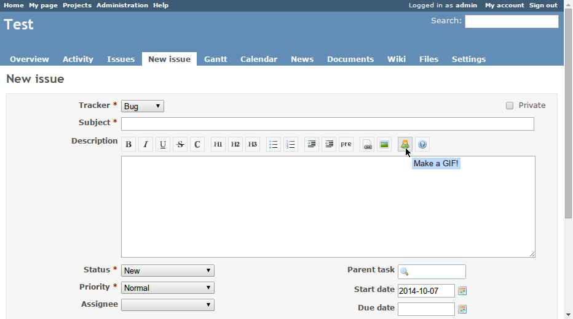
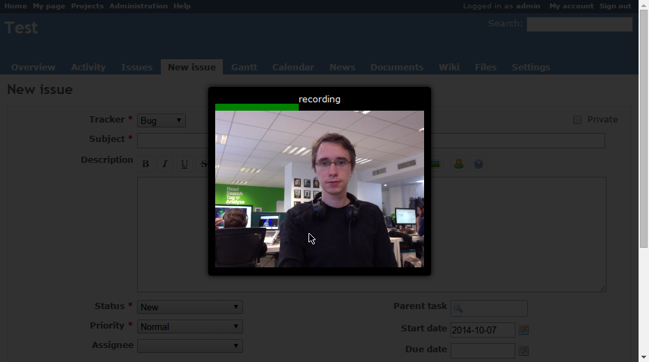

Redmine Make a GIF
==================

_Make a GIF_ is a [Redmine](http://www.redmine.org/) plugin similar to
[Github-selfies](https://github.com/thieman/github-selfies).

It will add a button in the editor toolbar to record a short animated GIF, store it and
insert the link in the editor.






Install
-------

Just clone this repository to your Redmine `plugins` directory. It has to be named
`redmine_make_a_gif`.

```bash
cd plugins
git clone https://github.com/florentsolt/redmine_make_a_gif.git
```


Browser support
---------------

This plugin uses new HTML technologies to record, build and store the GIF. It will only
work on browsers implementing the [MediaStream API](http://caniuse.com/#feat=stream), so:

* Mozilla Firefox 18+
* Google Chrome 21+
* Opera 12+


Special Thanks
--------------

This project is initialy based on [gifwall](https://github.com/sole/gifwall/), an
interactive animated GIF mosaic.


Read more
---------
* [How animated gif selfies fixed our team’s morale](http://www.threechords.org/blog/how-animated-gif-selfies-fixed-our-teams-morale/)
